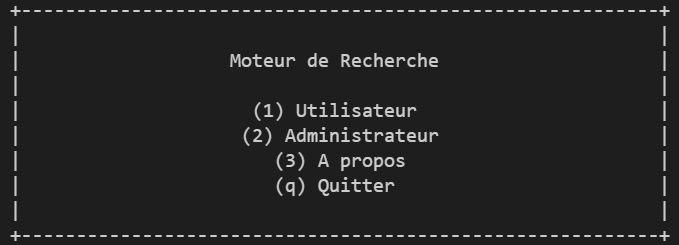
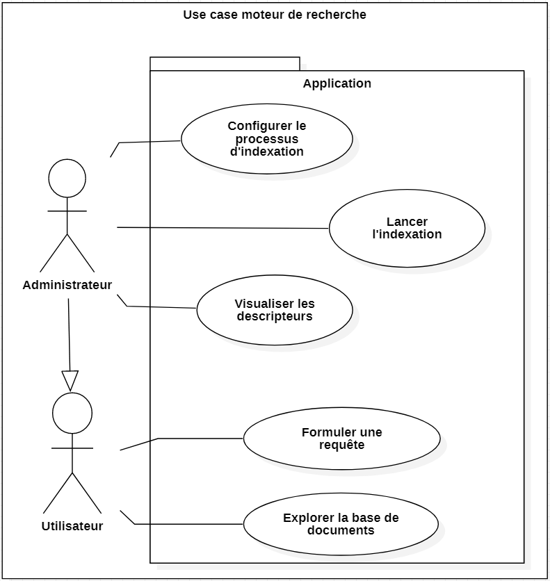

= [Projet Fil Rouge] Partie 1 - Moteur de recherche

Dernière mise à jour : 05/12/2021

== Installation 

WARNING: Prérequis : Posséder un environnement linux

Pour lancer le programme, veuillez exécuter la commande suivante dans le répertoire courant du projet.

NOTE: make main

== Présentation 

À partir d'une base de documents l'application permet de faire des recherches selon 3 types de formats : Texte - Image - Audio. Selon le format, nous avons différentes possibilités de recherche.

Voici un petit apercu de l'application : 

== Fonctionnalités 

Dans ce diagramme de use case, vous trouverez toutes les fonctionnalités de l'application.

WARNING: Toutes les fonctionnalités ne sont pas encore implémentées.

(Les cases cochées sont les fonctionnalités déjà codées)

- [ ] Indexation Texte
- [x] Indexation Image (+ sauvegarde dans la base)
- [x] Indexation Audio (+ sauvegarde dans la base)
- [ ] Comparaison Texte
- [ ] Comparaison Image
- [ ] Comparaison Audio
- [ ] Moteur de recherche - Texte
- [ ] Moteur de recherche - Image
- [ ] Moteur de recherche - Audio
- [x] Connexion pour le passage en mode admin
- [x] Différents menus

## Auteurs

- Peter Piriou--Dezy
- Guillaume Roussin
- Constant Roux
- Nelson Sanchez
- Julian Trani

