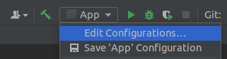
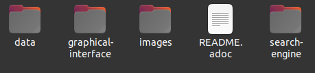
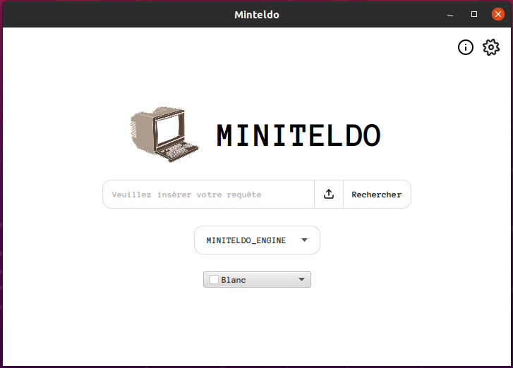

= [Projet Fil Rouge] Partie 1 - Moteur de recherche

Auteurs :
Constant ROUX,
Peter PIRIOU--DEZY,
Guillaume ROUSSIN,
Julian TRANI

Dernière mise à jour : 04/04/2022

== Installation 

WARNING: Prérequis : posséder un environnement linux

WARNING: Une version 1.17 de Java est requis, pour cela vous pouvez télécharger https://www.jetbrains.com/fr-fr/idea/download/#section=linux[IntelliJ] ;) 

WARNING: Ajouter cette ligne de commande dans les VM option de IntelliJ (Edit configuration/Modify Options/Add VM options) : *_--add-exports javafx.base/com.sun.javafx.event=org.controlsfx.controls_*

Avant d'utiliser l'application vous devez :

- Clonez le projet avec le lien suivant : https://github.com/Guillaume-prog/projet-fil-rouge

- Ajoutez le répertoire _data_ téléchargeable ici https://drive.google.com/file/d/1z-Gzd4vYDx38v6kFcMUgXJSrsMW1V9O8/view?usp=sharing[data], à la racine du projet comme ceci : 

== Présentation 

À partir du code C de la phase 1, nous avons réalisé une interface graphique en Java.
L'objectif de la phase est donc de faire communiquer la partie C et Java.

Voici un petit aperçu visuel de l'application :

== Fonctionnalités 

Voici une liste de toutes les fonctionnalités ajoutées et disponibles dans cette 2ème phase du PFR

- [x] Communication C/Java
- [x] Interface Java
- [x] Mode ouvert/fermé
- [x] Multi-moteur
- [x] Recherche complexe
- [x] Recherche couleur
- [x] Visualiser les descripteurs
- [x] Sauvegarder des requêtes

== Architecture de l'application

L'application possède quelques répertoires selon leur logique.

Voici un tableau récapitulatif des différents fichiers utilisé dans l'application :

[cols="1,2a"]
|===
| *Répertoire* | Description

| graphical-interface
| Contient toute l'interface graphique Java 

| search-engine
| Contient tout le code C de la premiere phase

| data
| Contient toute la base de données de l'application

|===
